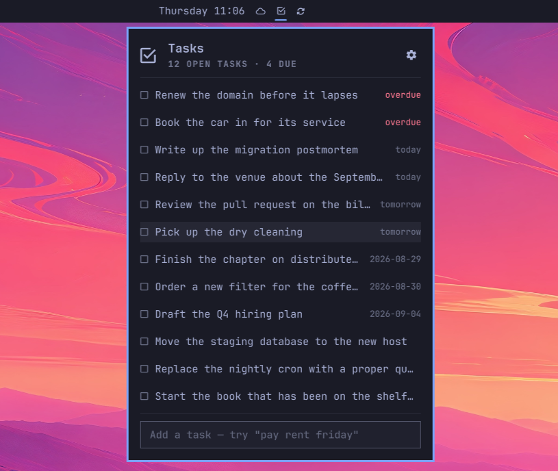
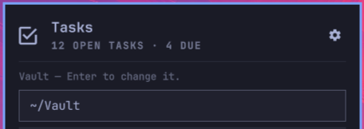

# Tasks

[Obsidian Tasks](https://publish.obsidian.md/tasks/) checkboxes in the Omarchy
bar: an icon that lights while something is open, and a popup to work through them.



## How it's meant to be used

The vault is the only state — no database, no account, no cache:

- **Capture anywhere, tick off here.** Add tasks on your phone in Obsidian or
  TaskForge; they reach the bar as soon as sync lands them.
- **Tasks live next to their context.** Obsidian Tasks is built for a `- [ ]`
  line written wherever you are — a meeting note, a project page, a daily note.
  The widget scans everything under the folder you point it at, so there's no
  need to herd them into one file.
- **This is a view, not the system of record.** Obsidian, a phone app and a text
  editor are equally valid ways to change a task. Nothing here owns the data.

## Install

```bash
omarchy plugin add https://github.com/m1kode/obsidian-tasks.git --enable
omarchy bar put m1kode.obsidian-tasks --section center
```

Requires `rg` and `python3`, both standard on Omarchy.

To remove it:

```bash
omarchy plugin remove m1kode.obsidian-tasks
```

That takes the widget out of the bar and deletes the plugin. Your notes are
untouched — the plugin only ever reads and writes markdown in the folder you
point it at, and removing it leaves every task exactly where it is.

## First run

**You have to tell it where your tasks are before it reads anything.** The popup
opens with a path field and no tasks, pre-filled with the vault Obsidian has
open — read from its registry (`~/.config/obsidian/obsidian.json`, or the
Flatpak and Snap equivalents), not by searching your filesystem. That's a
suggestion, nothing more.

Enter accepts it, or type your own. Closing the popup discards it and stores
nothing; only saving makes the widget read the folder. Point it at a whole vault
or one folder inside it — whatever you give it is the scan root, and tasks
outside it won't appear.

The field then moves behind the **⚙ gear** in the popup's top right, to change
folder any time.



Or set it from the shell and skip the prompt:

```bash
omarchy bar set m1kode.obsidian-tasks vaultPath /path/to/your/vault
```

Changing any setting needs `omarchy restart shell` to take effect.

## Format

Standard Obsidian Tasks emoji syntax. Due dates (`📅`) and priorities
(`🔺⏫🔼🔽⏬`) are read and sorted on; every other signifier is preserved
untouched, so an edit can't quietly drop metadata this widget doesn't read.

```markdown
- [ ] Renew car insurance 📅 2026-08-30
- [ ] Reply to landlord ⏫
- [x] Book dentist ✅ 2026-08-25
```

Ticking a task rewrites its line in place and stamps `✅` with today's date.

## Dates

A trailing date phrase in the add box becomes a due date and leaves the task text:

```
pay rent friday        →  - [ ] pay rent 📅 2026-08-28
review pr in 3 days    →  - [ ] review pr 📅 2026-08-29
call bank 2026-09-01   →  - [ ] call bank 📅 2026-09-01
```

Understood: `today`, `tomorrow`, `next week`, a weekday name, `in N days`,
`in N weeks`, `YYYY-MM-DD`. Naming today's weekday means the next one. Renaming a
task parses dates the same way — that's how you change an existing due date.
**English only**: `steuern morgen` keeps its text; `YYYY-MM-DD` works anywhere.

Two rules stop it rewriting what a task says: only *trailing* phrases count
(`friday night drinks` keeps its wording), and short weekday forms need an `on`
or `next` (`photograph the sun` keeps its last word, `retro on weds` gets a
date). The phrase is removed whole, so a preposition leading into it stays
behind — `some new tasks for today` becomes `some new tasks for`, dated today.

## Sync

Nothing here touches a network. The widget reads and writes files in a folder;
keeping that folder current is someone else's job, and Obsidian Sync, Syncthing,
git and Dropbox all do it.

Because sync can rewrite a file at any moment, writes match on the **exact line
text**, never a line number — if the line moved since the scan that drew the row,
the write is a no-op rather than a guess.

The vault is rescanned every 60s and whenever the popup opens, so a task added on
a phone surfaces within a minute.

## Settings

From the widget's entry in `~/.config/omarchy/shell.json`:

| Key | Default | What it does |
|---|---|---|
| `vaultPath` | *(auto)* | Folder scanned for checkboxes; empty means ask Obsidian |
| `inboxFile` | `Inbox.md` | Where *new* tasks are appended, relative to the vault |
| `countMode` | `all` | `all` lights the icon for any open task; `due` only for today or earlier |
| `refreshIntervalSec` | `60` | Rescan interval |

`.obsidian`, `.trash`, `.git` and `Templates` are always skipped — a daily-note
template full of `- [ ]` placeholders would otherwise inflate the count with
phantom tasks that appear in no note you can find.

## Keys

`j`/`k` move, `Enter` ticks or unticks, `e` edits the task under the cursor,
`a` jumps to the add box, `r` rescans, `Esc` closes.

## How it works

`Panel.qml` decides what to show; `bin/obsidian-tasks` does every read and write,
with `complete`, `uncomplete` and `rename` sharing one line-rewrite primitive.
