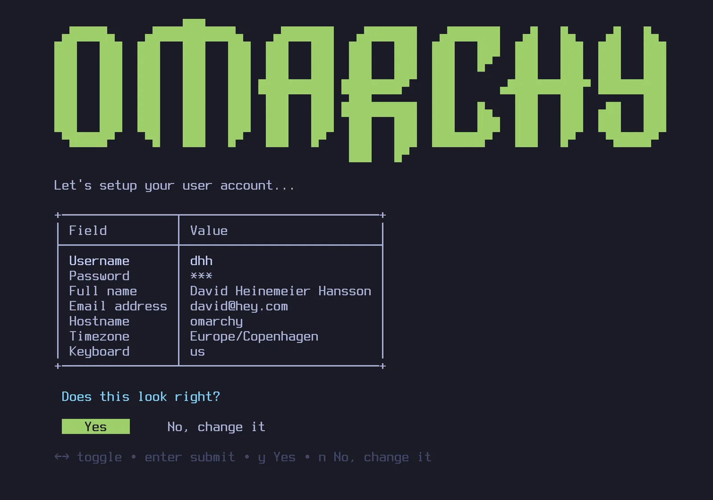

# Getting Started

Omarchy is installed using an ISO. You can choose between a full-disk install, which takes over the entire drive, or a free-space install, which puts Omarchy in the unallocated space on a drive — that's how you dual boot alongside Windows or another OS (see [dual-boot install](50-dual-boot-install.md) — note that you'll need to turn off BitLocker in Windows first). Either way, the installation defaults to full encryption, and the full-disk option will wipe the selected drive, so be sure to take a backup before using an existing one!

[Download the Omarchy ISO](https://omarchy.org/) first, put it on a USB stick (use [balenaEtcher](https://etcher.balena.io/) on Mac/Windows or [caligula](https://github.com/ifd3f/caligula) on Linux), and boot off the stick.

_You must turn off Secure Boot and/or TPM in the BIOS. You have to turn these off to be able to install Omarchy. They're Microsoft security schemes meant for Windows and Microsoft-affiliated Linux distributions._

Then answer the configuration questions, and confirm them like this:

 

Then select a drive for your installation, and sit back and watch the installation show go. It can be done in under a minute on the fastest modern machines, but it shouldn't take more than 5 minutes even on an older computer.

 

Now you're ready to Omarchy!

### Use a wired or 2.4ghz keyboard!

The full-disk encryption won't allow you to enter the password from a Bluetooth keyboard at startup. Just like you can't use a Bluetooth keyboard to enter the BIOS on a PC. You'll need a keyboard that either uses a 2.4ghz dongle or a cable (which is much nicer for latency anyway!). I personally love the [Lofree Flow84](https://www.lofree.co/products/lofree-flow-the-smoothest-mechanical-keyboard)!

### Installing for another owner

If you're setting up a machine for someone else — a family member, a new employee, a buyer — you shouldn't be answering the personal questions on their behalf. Hit `Ctrl + C` on the very first screen of the installer (the keyboard selection), and Omarchy will offer to prepare the machine for another owner instead. The system installs right away, but all the personal setup — keyboard layout, username, password — is deferred until the machine boots for the first time. The drive is still encrypted by default, and the password the new owner picks on that first boot becomes the encryption password too. (A machine you've already been using can be handed over without a reinstall too — see [resetting the computer](48-security.md).)

### Unattended installs

The ISO can also install completely on its own — no keyboard, no wizard — when it's handed its configuration on a second drive. That's the way to treat Omarchy as a base image for VMs and fleet machines. See [unattended installs](51-unattended-installs.md).

### No-encryption installations

Omarchy is installed with encryption by default. It's the safe, responsible choice for any computer that can possibly be lost or stolen. You don't want anyone with access to your hardware to be able to get your data!

But in special circumstances, like remote Omarchy installs on protected computers or for throw-away installations without sensitive data, you may want to install without encryption. You can hit `Ctrl + C` on the disk formatting confirmation to switch to an encryption-less installation.

### Help if you're stuck

If you get stuck, you can usually find someone willing to help in the _#omarchy-help_ channel on [the community Discord](https://omarchy.org/discord).
