# Themes

Omarchy comes with twenty-two beautiful themes. You can select between them via _Style > Theme_ in the Omarchy Menu (`Super + Space`) or hop directly to the theme selector using `Super + Ctrl + Shift + Space`.

Each theme styles the desktop, terminal, neovim, activity screen (btop), Chromium, and the entire Omarchy shell: top bar, menu, notifications, OSD, and the lock screen. (For Obsidian, you must manually select the Omarchy theme via _Appearance > Themes_ inside the app).

Themes have a set of background images that you can pick between using `Super + Ctrl + Space`.

You can find even more themes on [the extra themes page](https://omarchy.org/themes/) or even [make your own theme](43-making-your-own-theme.md).

 
_Tokyo Night_

 
_Catppuccin_

 
_Lumon_

 
_Ethereal_

 
_Everforest_

 
_Gruvbox_

 
_Miasma_

 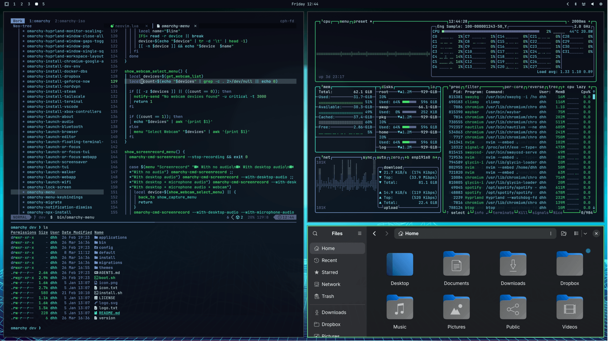
_Hackerman_

 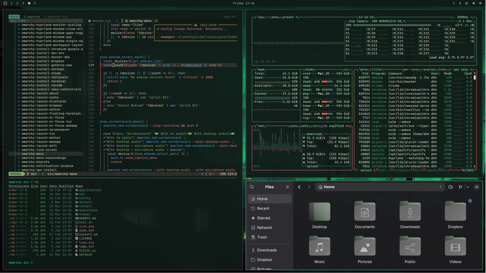
_Osaka Jade_

 
_Kanagawa_

 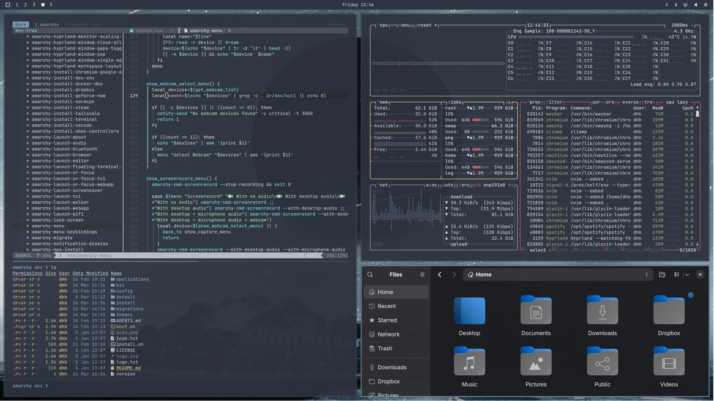
_Nord_

 
_Matte Black_

 
_Vantablack_

 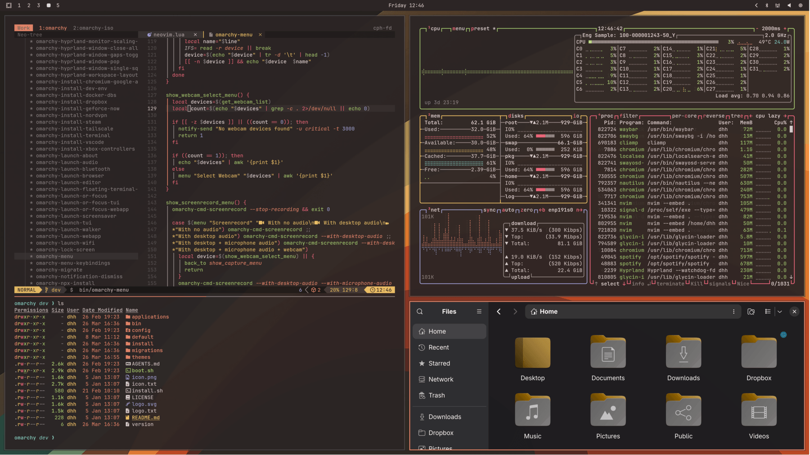
_Ristretto_

 
_Retro 82_

 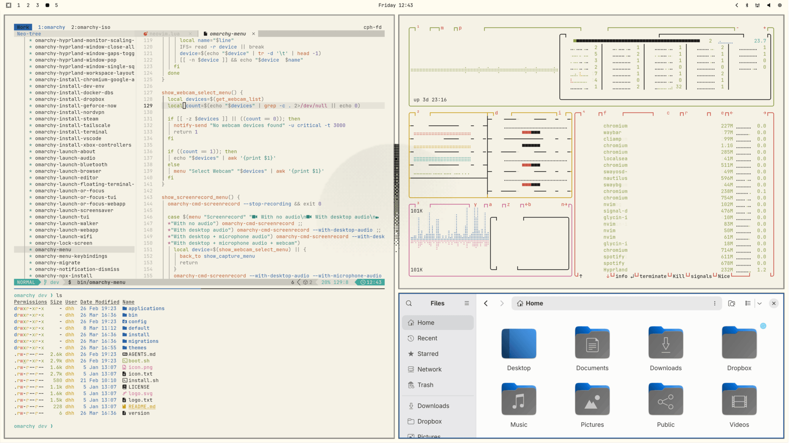
_Flexoki Light_

 
_Rose Pine_

 
_Catppuccin Latte_

 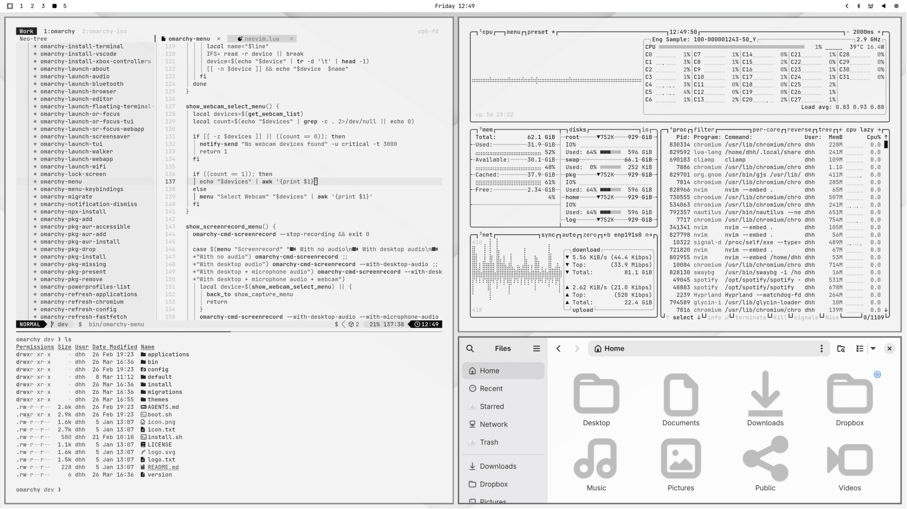
_White_

### Unlocks

Themes can also have a custom unlock design, which is used for the boot decryption process. You can select one of these under _Style > Unlock_. They look like this:

 
_Catppuccin_

 
_Catppuccin Latte_

 
_Ethereal_

 
_Everforest_

 
_Flexoki Light_

 
_Gruvbox_

 
_Hackerman_

 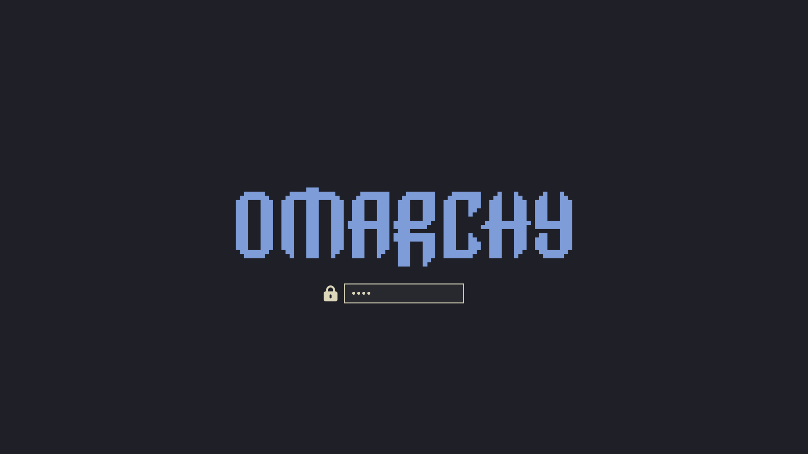
_Kanagawa_

 
_Lumon_

 
_Matte Black_

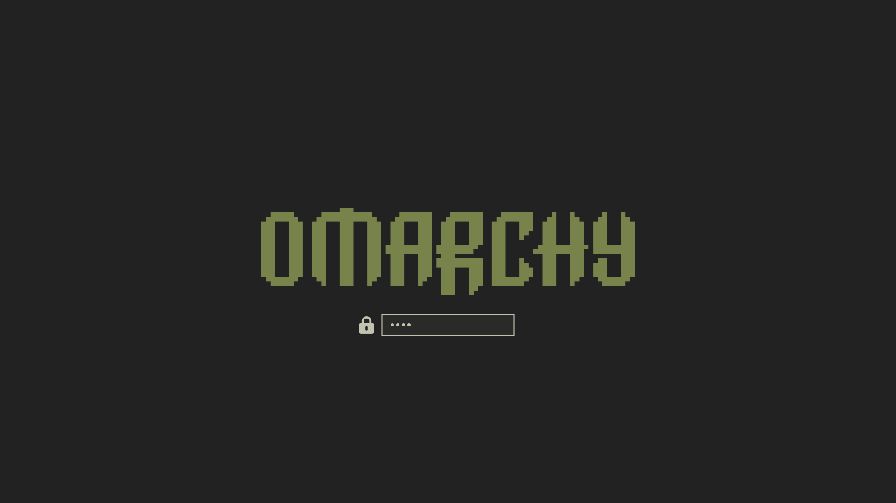
_Miasma_

 
_Nord_

 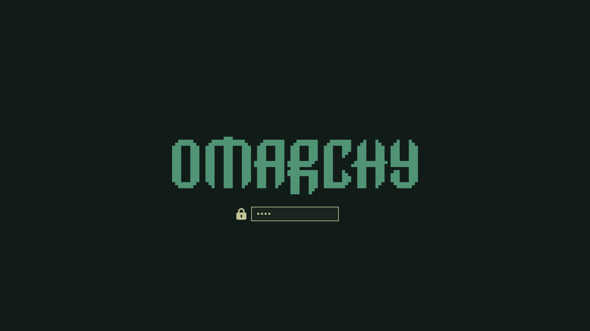
_Osaka Jade_

 
_Retro 82_

 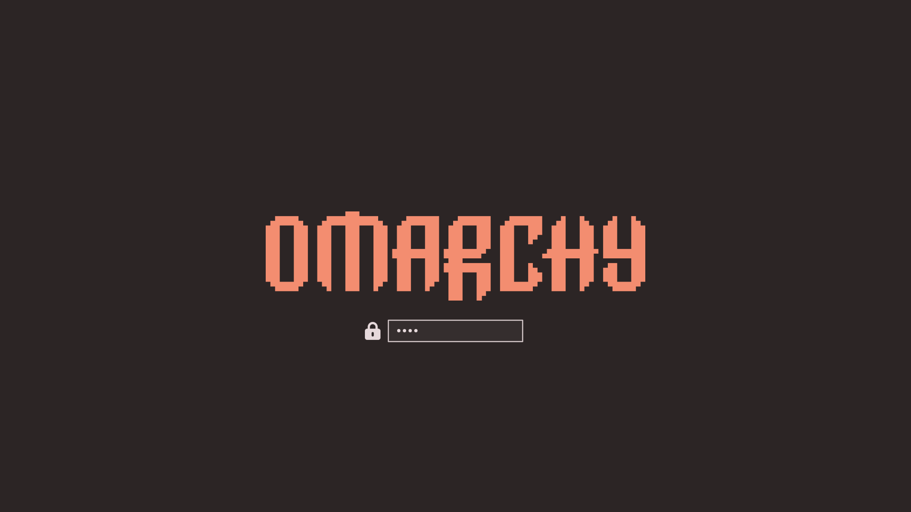
_Ristretto_

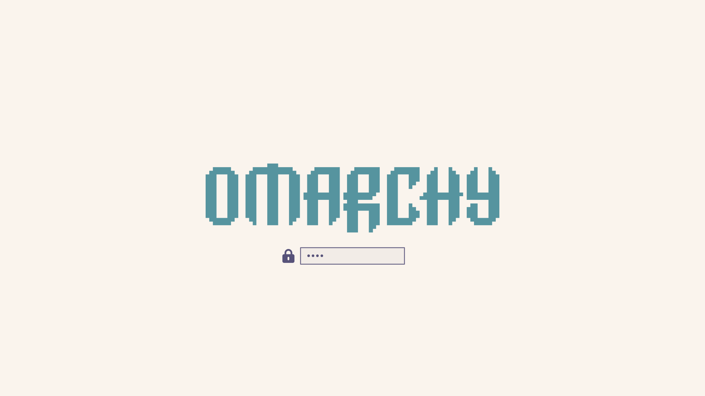
_Rose Pine_

 
_Tokyo Night_

 
_Vantablack_

 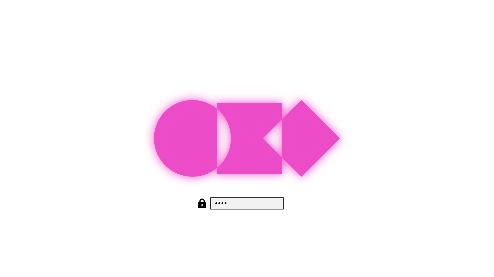
_White_
