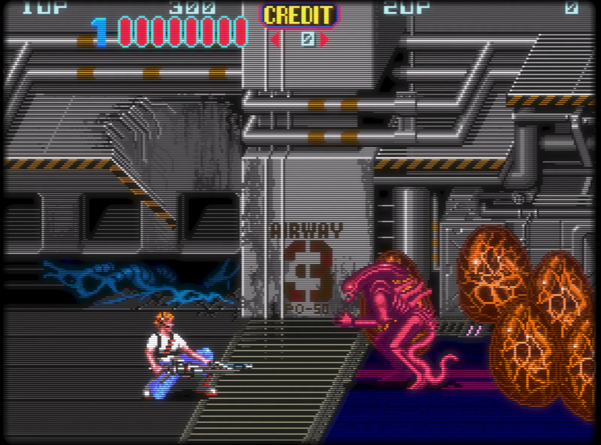
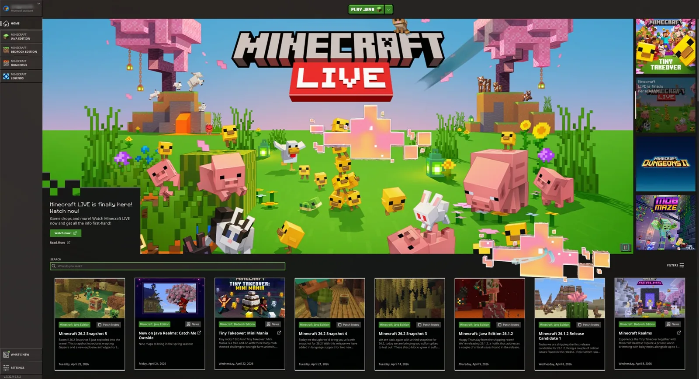
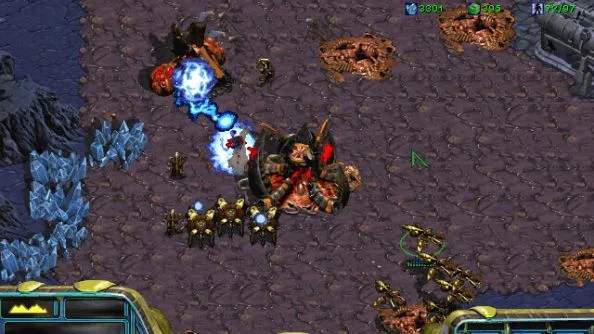

# Gaming

Omarchy isn't just for _pRoDUcTiVItY_, it's also for having fun, and what's more fun than gaming? Omarchy ships with a whole suite of gaming options — Steam and RetroArch for native and retro play, Battle.net, Lutris, and Heroic for non-Steam stores, Moonlight for PC streaming, Xbox Cloud Gaming + NVIDIA GeForce NOW for cloud, plus the evergreen Minecraft.

Thanks to Valve's incredible work on [the proton compatibility layer](https://en.wikipedia.org/wiki/Proton_(software)), there are now tens of thousands of playable modern games on Linux. Oh, and did you know that the [Steam Deck](https://store.steampowered.com/steamdeck/) actually runs Arch!

All gaming installers live under _Install > Gaming_ in the Omarchy menu (`Super + Space`). If you ever want to undo one, use _Remove > Gaming_.

## Steam

Install [Steam](https://store.steampowered.com/) by selecting _Install > Gaming > Steam_ from the Omarchy menu (`Super + Space`).

After you've installed it, you'll be able to launch Steam with `Super + Space`.

Note that Steam can take 10-20 seconds to start up, and it's not going to provide any visual feedback that it's loading.

 

## RetroArch

Install [RetroArch](https://www.retroarch.com/) by selecting _Install > Gaming > RetroArch_ from the Omarchy menu (`Super + Space`). It comes with the full set of libretro cores, so all the classic systems are covered.

RetroArch is fully preconfigured with the beautiful CRT Royale shader for that perfect retro look.

To get going:

1. Drop your BIOS files into `~/Games/bios` and your ROMs into `~/Games/roms`.
2. Launch RetroArch with `Super + Space` and typing `retro`.
3. Scan the `~/Games/roms` directory and you're ready to play.

You can also give a favorite game its own entry in the app launcher with _Install > Gaming > RetroArch Game Launcher_, which lets you pick a core and a ROM, and jump straight into the game from `Super + Space`.

 

## Xbox Cloud Gaming

Install the Xbox Cloud Gaming web app by selecting _Install > Gaming > Xbox Cloud Gaming_ from the Omarchy menu (`Super + Space`). It's "just" a web app for the service, but it's quick to start and runs great at 1080p.

If you already have Xbox Game Pass, this is a solid way to play Fortnite and other titles you can't run natively on Linux.

 

## NVIDIA GeForce Now

Install the cloud-gaming service [NVIDIA GeForce NOW](https://www.nvidia.com/en-us/geforce-now/) by selecting _Install > Gaming > NVIDIA GeForce NOW_ from the Omarchy menu (`Super + Space`). Another great way to play titles that aren't available natively on Linux.

 

## Minecraft

Install Minecraft by selecting _Install > Gaming > Minecraft_ from the Omarchy menu (`Super + Space`).

Like Steam, note that it can take a while after logging in or starting up for the next screen to appear, and you're not going to get any feedback while you're waiting.

 

## Xbox Controllers

Install support for Bluetooth Xbox controllers by selecting _Install > Gaming > Xbox Controllers_ from the Omarchy menu (`Super + Space`). Pair the controllers via Bluetooth (`Super + Ctrl + B`) and they'll work in all your games. You don't need this if you're just hardwiring your controller with a USB-C cable.

## Moonlight (Game streaming from a PC)

The [Moonlight client](https://github.com/moonlight-stream/moonlight-qt) comes preinstalled with Omarchy, so you can stream games from a Windows PC running [Sunshine](https://app.lizardbyte.dev/Sunshine/) right away. Launch Moonlight via `Super + Space`.

If both your Omarchy machine and the remote gaming PC are hardwired, the experience is indistinguishable from playing locally. Crank the resolution up to native, set the refresh to 120Hz, and max the bitrate — this is the best way to play competitive shooters like Fortnite on Linux.

You can also turn an Omarchy machine into the host by running `omarchy install service sunshine`, which installs Sunshine and opens the Moonlight streaming ports for your LAN and Tailscale.

## Battle.net

Install [Battle.net](https://eu.shop.battle.net/en-us) by selecting _Install > Gaming > Battle.net_ from the Omarchy menu (`Super + Space`). This gives you titles like Diablo, Starcraft, and World of Warcraft as a standalone install running under GE-Proton — no Steam, Lutris, or Heroic needed.

 

## Lutris (Windows games)

Install [Lutris](https://lutris.net/) by selecting _Install > Gaming > Lutris_ from the Omarchy menu (`Super + Space`). Lutris is the way to play Windows games from stores like EA and Ubisoft Connect that don't have their own installer above.

Installation is a little janky and looks like nothing is happening at times — just be patient, it's working in the background.

## Heroic Launcher (Epic Games)

Install the [Heroic Launcher](https://heroicgameslauncher.com/) by selecting _Install > Gaming > Heroic (Epic Games)_ from the Omarchy menu (`Super + Space`). Heroic lets you run Epic Games titles, like OddSparks, that don't rely on anti-cheat — plus games from GOG and Amazon Prime Gaming. Sadly, that means no Fortnite and no Rocket League — until Tim Sweeney comes to Linux, this is as close as it gets.

Like Lutris, it can feel slow and janky while installing games. Give it time.
