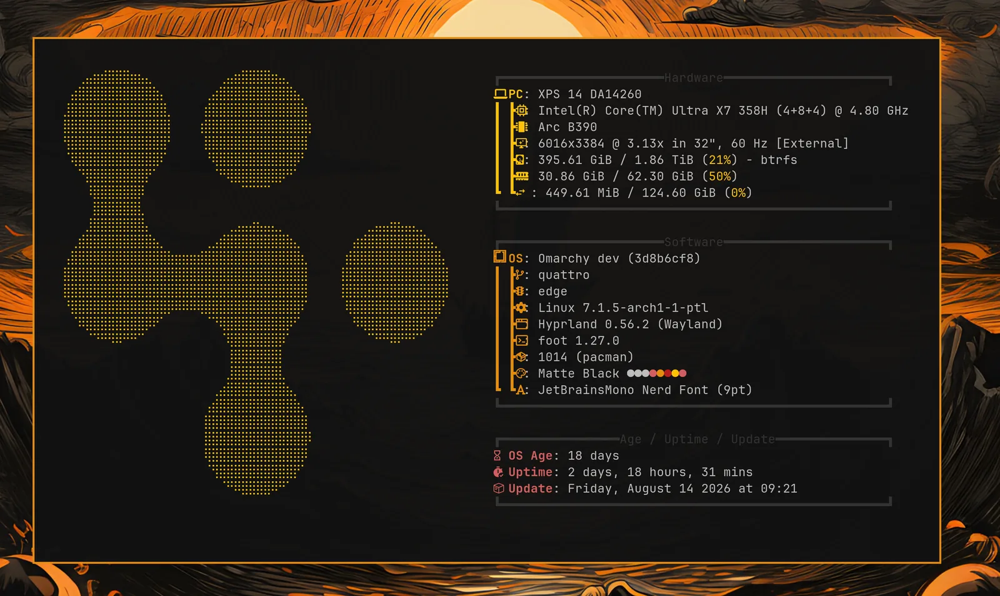

# Branding

Omarchy allows you to set your company logo or personal image for both the boot unlock, the screensaver, and the about screen.

### Boot unlock

You can use `omarchy plymouth preview` to see what your custom logo and colors would look like. It takes a background color, a text color, a logo png, and a path for the preview image:

```
omarchy plymouth preview '#1d2021' '#ebdbb2' logo.png preview.png
```

Then apply the setup with `omarchy plymouth set '#1d2021' '#ebdbb2' logo.png`, which will also give the SDDM login screen the same colors and logo. If you want to revert, you can use `omarchy plymouth reset`.

 

### Screensaver

You can change the logo used for the screensaver under _Style > Screensaver_. It's an ASCII logo, so you can edit the text directly, but you can also hand it a png or svg image, and we'll convert that to ASCII. It looks pretty cool.

 

There are three entries in that menu:

- **Edit Text** opens `~/.config/omarchy/branding/screensaver.txt` in your editor. Type or paste whatever you like — ASCII art, your name, a rude word. Save and quit, and the screensaver fires up immediately so you can see it.
- **Set From Image** opens a file picker for a png or svg, converts it to ASCII, and shows you the result. Logos with a clear silhouette work far better than photos.
- **Restore Default** puts the Omarchy logo back.

### About screen

The same three options are under _Style > About_ for the _About_ screen you get from the Omarchy menu, and they work identically — the file is `~/.config/omarchy/branding/about.txt`, and the About window pops up after each change. The About art is converted to a smaller size than the screensaver's, since it has to fit in a window rather than fill your display.

 

### Converting images yourself

Both of the _Set From Image_ options are just calling `omarchy transcode ascii`, which you can run directly if you want control over the conversion:

```
omarchy transcode ascii ~/logo.svg ~/.config/omarchy/branding/screensaver.txt --width 100
```

It takes `--width` and `--height` in terminal columns and rows, a `--mode` of either `braille` (the default, and much finer) or `block`, a `--threshold` percentage for deciding which pixels count as part of the logo, and `--invert` for when your logo is light on a dark background. If a conversion comes out as a blob, the threshold is usually the knob to turn.
