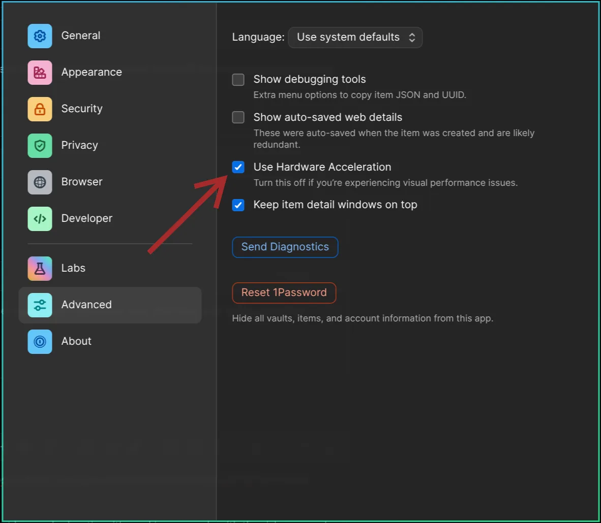

# Troubleshooting

### I broke my system with an update!

First try to [rollback your system](47-system-snapshots.md) the version before your recent update. If that doesn't work, use `omarchy-debug` to share with your problem on #omarchy-help in the Discord. And if all that fails, you can reinstall the defaults configs and packages using `omarchy-reinstall`.

### Why are some apps so large on my display?

Omarchy assumes a 2x high-resolution display, which requires setting `GDK_SCALE` to 2 in `~/.config/hypr/monitors.lua`. But if you're on a 1x display, you can change `local omarchy_gdk_scale = 2` to 1 (and then restart any app that's oversized). See [the manual on monitors](33-monitors.md).

For Spotify, you can use `Ctrl + Minus` to shrink the UI (and `Ctrl + Plus` to make it bigger).

### Why isn't Caps Lock working?

In Omarchy, Caps Lock has been designated to be the xcompose key. That's how you get [quick emojis](07-hotkeys.md#quick-emojis) and [other autocompletions](07-hotkeys.md#quick-completions) done. If you really miss using Caps Lock, you can remap the xcompose key to something else by editing `~/.config/hypr/input.lua`, like setting it to the right alt key:

```
hl.config({
  input = {
    kb_options = "compose:ralt",
  },
})
```

### My Wi-Fi, Bluetooth, audio, or trackpad just stopped working

Before you reboot, try restarting the offending subsystem on its own. _Update > Hardware_ in the Omarchy menu has Wi-Fi, Bluetooth, Audio, and Trackpad, and reloading one of those clears up the majority of "it worked five minutes ago" situations — a Bluetooth headset that won't reconnect, a trackpad that went dead after a suspend, sound that vanished when you unplugged a monitor.

### Why are my external speakers not playing?

Probably because they're not set as the primary output. Click on the speaker icon on the right side of the bar, and it'll open the volume popup where you can pick the output device (and mix per-app volumes too).

### My laptop speakers sound off

On some laptops, Omarchy automatically applies a speaker tuning that corrects the built-in speakers' frequency response. `omarchy audio tuning status` tells you whether one is active on your machine, and `omarchy audio tuning off` turns it off if you'd rather hear the speakers raw.

### Why can't I login or sudo with my password?

You probably typed it wrong too many times and got locked out. If this is happening on the lock screen, you can hit `CTRL + ALT + F2` to start a new TTY where you can login as root, then run `faillock --reset --user [your-username]`. That'll reset the lockout, and you're good to go.

### Why isn't my 1Password authorization prompts for 1Password SSH Agent / CLI appearing?

This can happen for 2 reasons:

In order for the rich approval prompt to appear, Settings > Advanced > Use Hardware Acceleration must be turned on. _Note: This requires a reboot to begin working._

 

Or if you haven't launched 1Password since booting up, the prompt will not appear.
